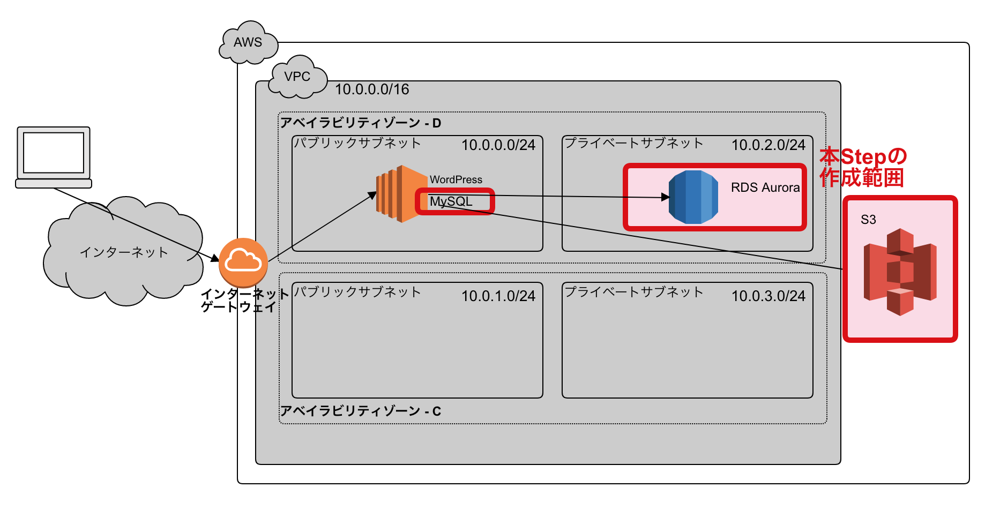
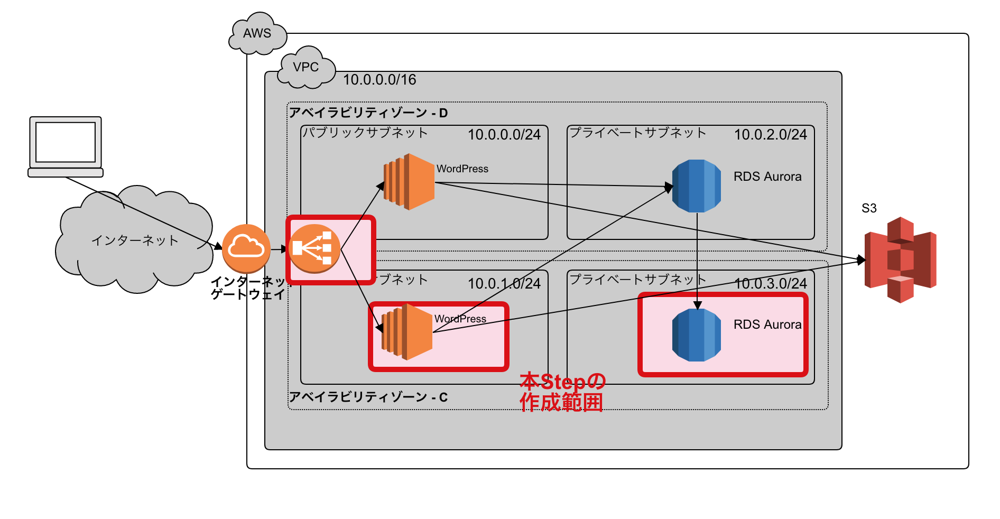

# AWS-Hands-On
このハンズオンではAWSマネジメントコンソール、シェルターミナルを使用し以下について学びます

## 事前準備
Chromeブラウザ  
SSH接続可能なターミナル(秘密鍵が利用できること)

## 前提知識
Linuxサーバでの基本的なファイル編集(本リポジトリ内ではvi,vimを用いている)  
Linuxシェルコマンド  
インターネットで用いられる基本的な技術(IPアドレス、名前解決、ゲートウェイ)

## このハンズオンで学べること

[Step-0](./Step-0.md)で学ぶこと

こちらではハンズオン用に用意したIAMでのAWSマネジメントコンソールログイン、AWSマネジメントコンソールオペレーションができることの確認を兼ねています。こちらができると以降のStepが学べます

----

[Step-1](./Step-1.md)で学ぶこと

1. VPCを使用したプライベートネットワークの作成。以降のStepを見据えMulti-AZに対応し、各々のアベイラビリティゾーンで冗長構成が組めるプライベートネットワーク構築技法
2. プライベートネットワーク内にAMIを使用しEC2インスタンスの作成
3. 作成したEC2インスタンスを用いてLinuxサーバのインフラ基礎(Webサーバ、DBサーバの起動停止と接続、サンプルアプリケーションWordpressによるWebアクセス確認。IPアドレス、デフォルトゲートウェイ、ネームサーバなどのネットワーク設定の確認)を見越しアップロードファイルの格納場所をAmazon S3に変更し対応します。

----

[Step-2](./Step-2.md)で学ぶこと

1. AWSのサービスを用いたLinuxミドルウェアレベルでの垂直分散技法(データベースをEC2から分離)
2. VPCを使用した複数のプライベートネットワークの利用(ネットワーク1 インターネットゲートウェイとしてのパブリックサブネット、ネットワーク2 データ格納セグメントとしてのプライベートサブネット)
3. Amazon Auroraの作成
4. 作成したAurora2インスタンスを用いてMySQL CLI基礎、意図したプライベートサブネットに作成したことの確認(IPアドレスなど)
5. Amazon S3を用いた共有フォルダの実装

----

[Step-3](./Step-3.md)で学ぶこと

1. AWSのサービスELB(ALB)の構築、ELB(ALB)用いたアクセス分散、Webサーバ(+アプリケーション)レイヤの水平分散技法
2. Auroraを異なるアベイラビリティゾーンにレプリカを作成しMultiA-Z構成としクラスタリング構成例での冗長化の理解
3. MultiA-Z構成のAuroraインスタンスを実際にフェイルオーバーさせ可用性の理解
4. 作成したEC2インスタンス、Aurora2インスタンスを用いて、意図したサブネットに作成したことの確認(IPアドレス、デフォルトゲートウェイ、ネームサーバなど)

