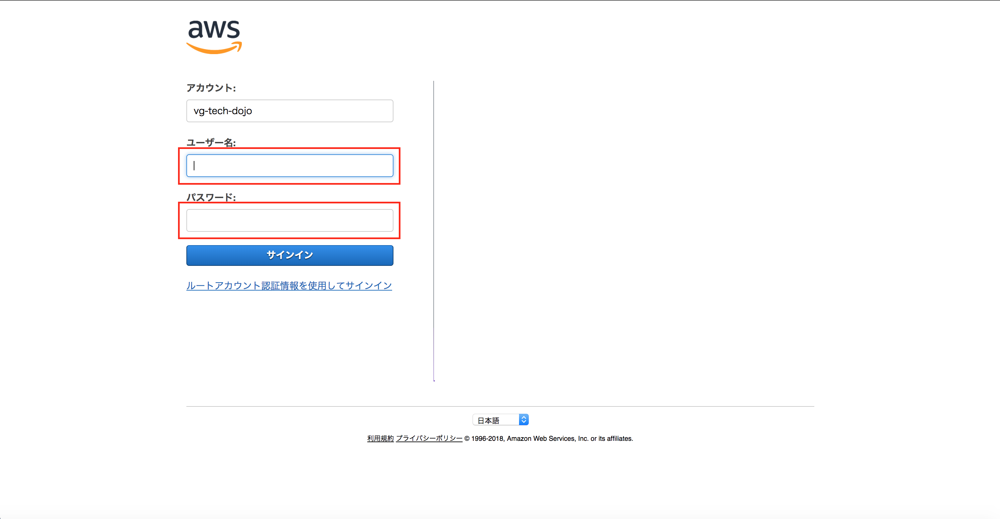
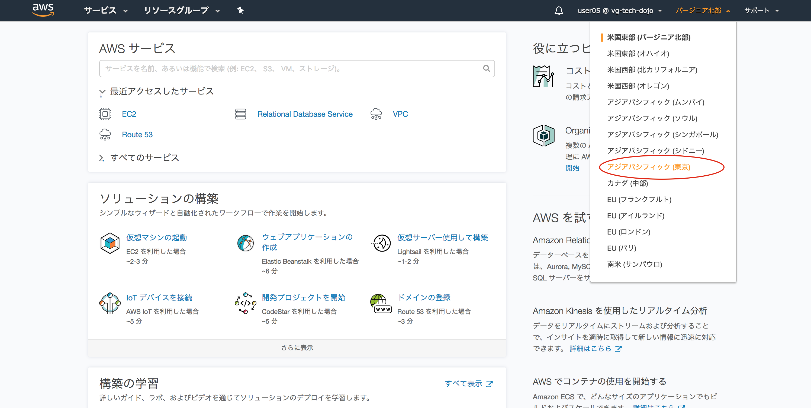
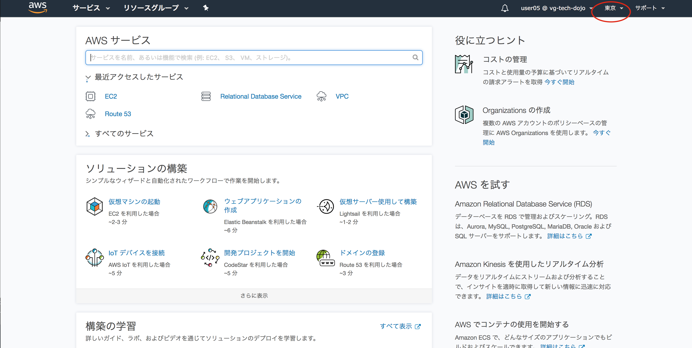

# Step-0
この章では全てのStepを行う前に必要な準備について記載します

## ログイン
**こちらが提示したURLでログイン画面が開けます。合わせて連絡した今回のハンズオン用のIAMユーザのユーザ、パスワードでログインしましょう**

## リージョン選択
全てのStepでは東京リージョンを選択した状態で進めます。必ず東京リージョンを設定しましょう。

画像右上のリージョン選択から「アジアパシフィック（東京）」を選択

東京が選択されていること

## Question リージョンとは
リージョンについて調べてみましょう(5分)

**ここまでのオペレーションでStep0は完了です！**
