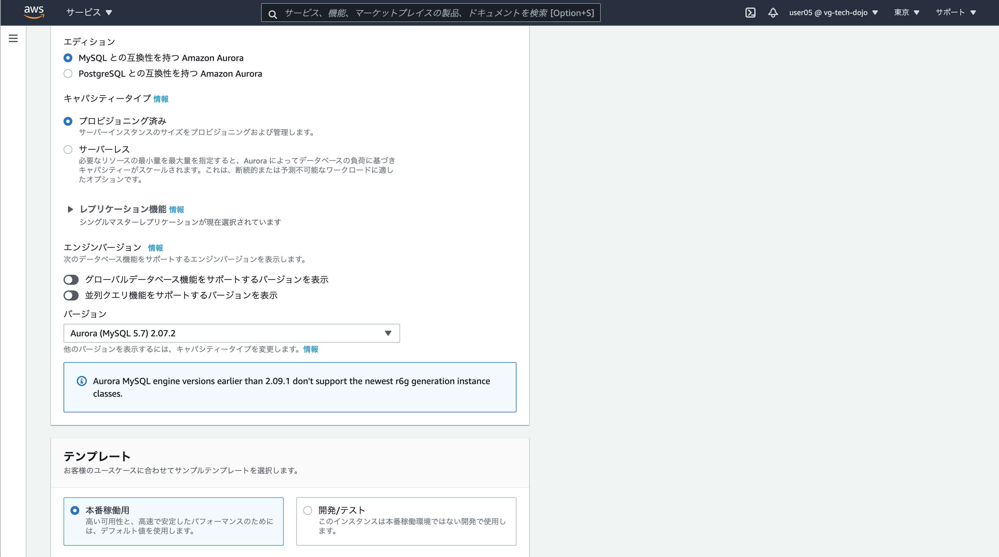

# Step-2
Step-2ではミドルウェアレベルでの垂直分散を行います。具体的には「パブリックサブネット」内のEC2単体で賄っていたミドルウェアのうちMySQLを「プライベートサブネット」に「Amazon Aurora MySQL」を利用して切り出します。更にStep-3でのWebサーバの水平分散を見越しアップロードファイルの格納場所をAmazon S3に変更し対応します。

## 概要図


----

## Question 垂直分散とは
垂直分散について調べてみましょう(10分)

## Question S3とは
S3について調べてみましょう(5分)

## DB用セキュリティグループの作成
**ここではStep-1で作成したEC2インスタンス内にあるMySQLを垂直分散させるために、10.0.2.0のプライベートサブネットに作るAurora用のセキュリティグループを作成します。サービスからEC2を選択しましょう**


----
**セキュリティグループタグからセキュリティグループの作成ボタンを押下**


----
**以下の設定値を設定しましょう。ルールの追加を押下**

|項目|設定値|
|:-|:-|
|セキュリティグループ名|db-ユーザ名 (例 db-user05)|
|説明|RDS for Aurora|
|VPC|作成したVPCを指定|


----
**MySQL/Auroraを選択し、ソースのカラムでは web などのキーワードで補完させ自分が作成したwebサーバ用のセキュリティグループを選択しましょう。選択ご作成ボタンを押下**


----
**作成したセキュリティグループ(db-userXX)が作成されていることを確認しましょう**


----

## DBサブネットグループの作成
**次にDB用のサブネットグループを作成します。サービスからRDSのリンクをクリック**


----
**左下のサブネットグループのリンクをクリックし、DBサブネットグループの作成ボタンを押下**


----
**サブネットグループの詳細を設定しましょう。**

|項目|設定値|
|:-|:-|
|名前|db subnet ユーザ名 (例 db subnet user05)|
|説明|RDS for Aurora|
|VPC|作成したVPC(vpc-userXX)を指定|


----
**引き続き下にスクロールしサブネットの追加を行いましょう。以降のオペレーションをアベイラビリティゾーン1d,1cで行います。アベイラビリティゾーンから1dを選択、プライベートネットワークの10.0.2.0を選択、サブネットを追加しますボタンを押下、下段に追加されていることを確認、アベイラビリティゾーンから1cを選択、プライベートネットワークの10.0.3.0を選択、サブネットを追加しますボタンを押下、下段に追加されていることを確認、最後に作成ボタンを押下**


----
**作成されていることを確認しましょう**


----

## RDS Auroraインスタンスの作成
**これまでの準備を踏まえ、10.0.2.0のプライベートネットワークにRDS Auroraインスタンスを作成しましょう。データベースタブからインスタンスの起動ボタンを押下**


----
**Standard Create、Amazon Auroraを選択し下へスクロール**


----
**リージョン別、１つのライターと複数のリーダーを指定しスクロール**



----
**本番稼働用を選択、DBクラスター識別子では以下の設定をしましょう**

|項目|設定値|
|:-|:-|
|DBクラスター識別子|wp-ユーザID-cluster(例 wp-user05-cluster)|


----
**認証情報の設定ではは以下の設定をしましょう**

|項目|設定値|
|:-|:-|
|マスターユーザ名|admin|
|マスターパスワード|wordpress|
|マスターパスワード確認|wordpress|


----
**DBインスタンスクラスは可用性と耐久性は以下にしましょう**

|項目|設定値|
|:-|:-|
|DBインスタンスクラス|「バースト可能クラス」「db.ts.small」|
|マルチAZ配置|Auroraレプリカを作成しない|


----
**接続は以下に設定しましょう(追加の接続設定を開きましょう)**

|項目|設定値|
|:-|:-|
|VPC|自身が作成したVPC|
|サブネットグループ|自身が作成したサブネットグループ|
|パブリックアクセス|なし|


----
**設定は以下に設定しましょう**

|項目|設定値|
|:-|:-|
|VPCセキュリティグループ|既存の選択|
|VPCセキュリティグループ|自身が作成したセキュリティグループのみ選択(defaultは削除)|
|アベイラビリティゾーン|ap-northeast-1d|


----
**追加設定で畳まれた箇所を開きましょう**


|項目|設定値|
|:-|:-|
|DBインスタンス識別子|wb-user05|
|最初のデータベース名|wordpress|


----
**「暗号を無効化」を選択**


----
**拡張モニタリングのチェックを外す**


----
**マイナーバージョン自動アップブレードの有効化のチェックを外す、削除保護の有効化のチェックを外す、データベースの作成を押下**


----
**左のデータベースタブをクリックし、右側に作成したAuroraクラスター、インスタンスが表示されることを確認しましょう。ステータスが利用可能になるまでに数分掛かります**


----

## Question RDS、Auroraとは
今作成したRDS(Relational Database Service)、Auroraについて調べてみましょう(10分)

----
**クラスターのリンクをクリックし自分のユーザ名のあるクラスター識別子のリンクをクリックしましょう**


----
**クラスターエンドポイント(上)、読み込みエンドポイント(下)をメモしましょう。このエンドポイントがAuroraにアクセスする際に利用します**


----

## 接続確認
**EC2サーバにSSH接続し、EC2サーバからAuroraに接続してみましょう。また作成したAuroraインスタンスが意図したセグメントに配置されているかも確認しましょう。**

```
$ ssh -i 1day-userXX.pem -o StrictHostKeyChecking=no ec2-user@ec2-XXXXXX.com
[ec2-user@ip-10-0-0-65 ~]$
```

**クラスタエンドポイントを使用してAuroraに接続しましょう。読み書きの権限についても確認しましょう。**

**注意 wp-userXX-cluster.cluster-cenae7eyijpr.ap-northeast-1.rds.amazonaws.comは各自のクラスタエンドポイントに直すこと。パスワードはAurora作成時に設定した内容を指定すること**

```
$ mysql -u admin -p -hwp-user05-cluster.cluster-cenae7eyijpr.ap-northeast-1.rds.amazonaws.com

mysql> show databases;
+--------------------+
| Database           |
+--------------------+
| information_schema |
| mysql              |
| performance_schema |
| wordpress          |
+--------------------+
4 rows in set (0.00 sec)

mysql> exit
```

**続いてネットワークセグメントの確認(クラスタエンドポイント)をしましょう**

```
$ nslookup wp-user05-cluster.cluster-cenae7eyijpr.ap-northeast-1.rds.amazonaws.com
Server:     10.0.0.2
Address:    10.0.0.2#53

Non-authoritative answer:
wp-user05-cluster.cluster-cenae7eyijpr.ap-northeast-1.rds.amazonaws.com canonical name = wp-user05.cenae7eyijpr.ap-northeast-1.rds.amazonaws.com.
Name:   wp-user05.cenae7eyijpr.ap-northeast-1.rds.amazonaws.com
Address: 10.0.2.226
```

**読み込みエンドポイントを使用してAuroraに接続しましょう。読み書きの権限についても確認しましょう。**

**注意 wp-userXX-cluster.cluster-ro-cenae7eyijpr.ap-northeast-1.rds.amazonaws.comは各自の読み込みエンドポイントに直すこと。パスワードはAurora作成時に設定した内容を指定すること**

```
$ mysql -u admin -p -hwp-userXX-cluster.cluster-ro-cenae7eyijpr.ap-northeast-1.rds.amazonaws.com

mysql> show databases;
+--------------------+
| Database           |
+--------------------+
| information_schema |
| mysql              |
| performance_schema |
| wordpress          |
+--------------------+
4 rows in set (0.00 sec)

mysql> exit
```

**続いてネットワークセグメントの確認(読み込みエンドポイント)をしましょう**

```

$ nslookup wp-user05-cluster.cluster-ro-cenae7eyijpr.ap-northeast-1.rds.amazonaws.com
Server:     10.0.0.2
Address:    10.0.0.2#53

Non-authoritative answer:
wp-user05-cluster.cluster-ro-cenae7eyijpr.ap-northeast-1.rds.amazonaws.com  canonical name = wp-user05.cenae7eyijpr.ap-northeast-1.rds.amazonaws.com.
Name:   wp-user05.cenae7eyijpr.ap-northeast-1.rds.amazonaws.com
Address: 10.0.2.226
```

## データ移行
**原始的なバックアップリストアの機能を用いてEC2インスタンスのMySQL内にあるWordpressのデータをAuroraに移行します**

**EC2インスタンスにログイン(事前にログインしてる場合は割愛する)**

```
$ ssh -i 1day-userXX.pem -o StrictHostKeyChecking=no ec2-user@ec2-XXXXXX.com
[ec2-user@ip-10-0-0-65 ~]$
```

**mysqldumpを使いEC2インスタンスMySQLからデータバックアップ。パスワードは設定した内容を指定(wordpress)**

```
$ mysqldump -u root -p wordpress > export.sql
Enter password:
[ec2-user@ip-10-0-0-65 ~]$ ll
合計 220
-rw-rw-r-- 1 ec2-user ec2-user 221255  3月 30 00:55 export.sql
```

**EC2インスタンスのMySQLは今後使用しないので停止し、自動起動の設定を抑止しましょう**

```
$ sudo systemctl disable mysqld.service
$ sudo systemctl stop mysqld.service
```

**データベースのリストア**

**Auroraのクラスタエンドポイントを指定してexport.sqlをリストアしましょう**

```
mysql -u admin -p -hwp-userXX-cluster.cluster-cenae7eyijpr.ap-northeast-1.rds.amazonaws.com  wordpress < export.sql
Enter password:
```

## WordpressのDB接続変更

```
$ sudo vi /var/www/html/wordpress/wp-config.php
- define('DB_HOST', 'localhost');
+ define('DB_HOST', 'wp-userXX-cluster.cluster-cenae7eyijpr.ap-northeast-1.rds.amazonaws.com');
```

**ブラウザでWordpressサイトである、EC2インスタンスのパブリック DNS (IPv4)を開きましょう。データリストア前と同様にWordpressが表示されれば成功です。**

## WordPressにプラグインの導入
**S3を利用するためにWordPressにプラグインを導入しましょう。最初に「Amazon Web Services」で検索し、今すぐインストールボタンをクリックしましょう。**


----
**有効化をクリック**


----
**次に「WP Offload S3 Lite」を検索し今すぐインストールボタンをクリックしましょう**


----
**有効化をクリック**


----

**EC2インスタンスにログイン(事前にログインしてる場合は割愛する)**

```
$ ssh -i 1day-userXX.pem -o StrictHostKeyChecking=no ec2-user@ec2-XXXXXX.com
[ec2-user@ip-10-0-0-65 ~]$
```

**以下の2行(+は不要)を追記しましょう。アクセスキー、シークレットアクセスキーは事前に配布したものに書き換えましょう**
```
$ sudo vi /var/www/html/wordpress/wp-config.php
+ define( 'DBI_AWS_ACCESS_KEY_ID', '********************' );
+ define( 'DBI_AWS_SECRET_ACCESS_KEY', '********************************' );
```

----
**S3の作成、サービスからS3を選択**


----
**バケットを作成するボタンを押下**


----
**S3名は「s3-1day-userXX」ユーザIDは自身のを指定、その後、作成ボタンを押下**


----
**作成したS3のリンクを押下**


----
**アクセス権限、パブリックアクセス権限、編集を押下**


----
**チェックを全て外す**


**注意：このACLの設定は今回の勉強会用であり、正規のサイト構築時にはNGです。必要なACLの設定を心がけましょう**
----
**アクセスコントロールリスト、Everyoneを押下**


----
**全てにチェックを入れ保存を押下**


----
**Media Libraryタブを選択し、作成したS3バケット名を入力し、Save Bucketボタンを押下**


----
**適当な画像を使ってブログを新規投稿しましょう**

**ブログの画像アドレスをコピーしS3のアドレスが指し示しているか確認しましょう**


----
**ここまでのオペレーションでStep2は完了です！**
