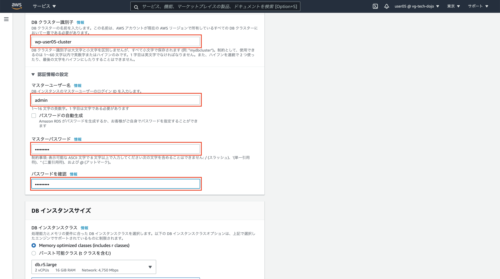

# Step-2

Step-2 ではミドルウェアレベルでの垂直分散を行います。具体的には「パブリックサブネット」内の EC2 単体で賄っていたミドルウェアのうち MySQL を「プライベートサブネット」に「Amazon Aurora MySQL」を利用して切り出します。更に Step-3 での Web サーバの水平分散を見越しアップロードファイルの格納場所を Amazon S3 に変更し対応します。

## 概要図


---

## Question 垂直分散とは

垂直分散について調べてみましょう(10 分)

## Question S3 とは

S3 について調べてみましょう(5 分)

## DB 用セキュリティグループの作成

**ここでは Step-1 で作成した EC2 インスタンス内にある MySQL を垂直分散させるために、10.0.2.0 のプライベートサブネットに作る Aurora 用のセキュリティグループを作成します。サービスから EC2 を選択しましょう**


---

**セキュリティグループタグからセキュリティグループの作成ボタンを押下**


---

**以下の設定値を設定しましょう。ルールの追加を押下**

| 項目                   | 設定値                     |
| :--------------------- | :------------------------- |
| セキュリティグループ名 | db-ユーザ名 (例 db-user05) |
| 説明                   | RDS for Aurora             |
| VPC                    | 作成した VPC を指定        |


---

**MySQL/Aurora を選択し、ソースのカラムでは web などのキーワードで補完させ自分が作成した web サーバ用のセキュリティグループを選択しましょう。(説明は「RDS for Aurora」を記載)**


---

**設定後下にスクロールし「セキュリティグループを作成」を押下**


---

**「セキュリティグループ」に遷移**


---

**作成したセキュリティグループ(db-userXX)が作成されていることを確認しましょう**


---

## DB サブネットグループの作成

**次に DB 用のサブネットグループを作成します。サービスから RDS のリンクをクリック**


---

**左下のサブネットグループのリンクをクリックし、DB サブネットグループの作成ボタンを押下**


---

**サブネットグループの詳細を設定しましょう。**

| 項目 | 設定値                                   |
| :--- | :--------------------------------------- |
| 名前 | db-subnet-ユーザ名 (例 db-subnet-user05) |
| 説明 | RDS for Aurora                           |
| VPC  | 作成した VPC(vpc-userXX)を指定           |


---

**引き続き下にスクロールしサブネットの追加を行いましょう。以降のオペレーションをアベイラビリティゾーン 1d,1c で行います。アベイラビリティゾーンから 1d を選択、プライベートネットワークの 10.0.2.0 を選択、サブネットを追加しますボタンを押下、下段に追加されていることを確認、アベイラビリティゾーンから 1c を選択、プライベートネットワークの 10.0.3.0 を選択、サブネットを追加しますボタンを押下、下段に追加されていることを確認、最後に作成ボタンを押下**


---

**作成されていることを確認しましょう**


---

## RDS Aurora インスタンスの作成

**これまでの準備を踏まえ、10.0.2.0 のプライベートネットワークに RDS Aurora インスタンスを作成しましょう。データベースタブからインスタンスの起動ボタンを押下**


---

**Standard Create、Amazon Aurora を選択し下へスクロール**


---

**画面の通りなら特に設定せずスクロール**


---

**本番稼働用を選択、DB クラスター識別子、認証情報は以下の設定をしましょう**

| 項目                   | 設定値                                     |
| :--------------------- | :----------------------------------------- |
| DB クラスター識別子    | wp-ユーザ ID-cluster(例 wp-user05-cluster) |
| マスターユーザ名       | admin                                      |
| マスターパスワード     | wordpress                                  |
| マスターパスワード確認 | wordpress                                  |



---

**DB インスタンスクラスは可用性と耐久性は以下にしましょう**

| 項目                       | 設定値                                |
| :------------------------- | :------------------------------------ |
| 以前の世代のクラスを含める | チェック                              |
| DB インスタンスクラス      | 「バースト可能クラス」「db.ts.small」 |
| マルチ AZ 配置             | Aurora レプリカを作成しない           |


---

**接続は以下に設定しましょう(追加の接続設定を開きましょう)**

| 項目                            | 設定値                                             |
| :------------------------------ | :------------------------------------------------- |
| Virtual Private Cloud (VPC)     | 自身が作成した VPC                                 |
| サブネットグループ              | 自身が作成したサブネットグループ                   |
| パブリックアクセス可能          | なし                                               |
| 既存の VPC セキュリティグループ | 自身が作成したセキュリティグループ、default は削除 |


---

**設定は以下に設定しましょう**

| 項目                   | 設定値          |
| :--------------------- | :-------------- |
| アベイラビリティゾーン | ap-northeast-1d |

**追加設定で畳まれた箇所を開きましょう**

| 項目                 | 設定値    |
| :------------------- | :-------- |
| 最初のデータベース名 | wordpress |


---

**「暗号を有効化」のチェックをはずす(今回のハンズオン進行のため、本来はチェックのまま)**

**「拡張モニタリング」のチェックを外す(今回のハンズオン進行のため、本来はチェックのまま)**


---

**マイナーバージョン自動アップブレードの有効化のチェックを外す(今回のハンズオン進行のため、本来はチェックのまま)**

**削除保護の有効化のチェックを外す(今回のハンズオン進行のため、本来はチェックのまま)**

**データベースの作成を押下**


---

**左のデータベースタブをクリックし、右側に作成した Aurora クラスター、インスタンスが表示されることを確認しましょう。ステータスが利用可能になるまでに数分掛かります。利用可能になったら「DB 識別子」のリンクを押下**


---

**クラスターエンドポイント(上)、読み込みエンドポイント(下)をメモしましょう。このエンドポイントが Aurora にアクセスする際に利用します(メモしておきましょう)**


---

## Question RDS、Aurora とは

今作成した RDS(Relational Database Service)、Aurora について調べてみましょう(10 分)

---

## 接続確認

**EC2 サーバに SSH 接続し、EC2 サーバから Aurora に接続してみましょう。また作成した Aurora インスタンスが意図したセグメントに配置されているかも確認しましょう。**

```
$ ssh -i 1day-userXX.pem -o StrictHostKeyChecking=no ec2-user@ec2-XXXXXX.com
[ec2-user@ip-10-0-0-65 ~]$
```

**クラスタエンドポイントを使用して Aurora に接続しましょう。読み書きの権限についても確認しましょう。**

**注意 wp-userXX-cluster.cluster-cenae7eyijpr.ap-northeast-1.rds.amazonaws.com は各自のクラスタエンドポイントに直すこと。パスワードは Aurora 作成時に設定した内容を指定すること**

```
$ mysql -u admin -p -hwp-user05-cluster.cluster-cenae7eyijpr.ap-northeast-1.rds.amazonaws.com

mysql> show databases;
+--------------------+
| Database           |
+--------------------+
| information_schema |
| mysql              |
| performance_schema |
| wordpress          |
+--------------------+
4 rows in set (0.00 sec)

mysql> exit
```

**続いてネットワークセグメントの確認(クラスタエンドポイント)をしましょう**

```
$ nslookup wp-user05-cluster.cluster-cenae7eyijpr.ap-northeast-1.rds.amazonaws.com
Server:     10.0.0.2
Address:    10.0.0.2#53

Non-authoritative answer:
wp-user05-cluster.cluster-cenae7eyijpr.ap-northeast-1.rds.amazonaws.com canonical name = wp-user05.cenae7eyijpr.ap-northeast-1.rds.amazonaws.com.
Name:   wp-user05.cenae7eyijpr.ap-northeast-1.rds.amazonaws.com
Address: 10.0.2.226
```

**読み込みエンドポイントを使用して Aurora に接続しましょう。読み書きの権限についても確認しましょう。**

**注意 wp-userXX-cluster.cluster-ro-cenae7eyijpr.ap-northeast-1.rds.amazonaws.com は各自の読み込みエンドポイントに直すこと。パスワードは Aurora 作成時に設定した内容を指定すること**

```
$ mysql -u admin -p -hwp-userXX-cluster.cluster-ro-cenae7eyijpr.ap-northeast-1.rds.amazonaws.com

mysql> show databases;
+--------------------+
| Database           |
+--------------------+
| information_schema |
| mysql              |
| performance_schema |
| wordpress          |
+--------------------+
4 rows in set (0.00 sec)

mysql> exit
```

**続いてネットワークセグメントの確認(読み込みエンドポイント)をしましょう**

```

$ nslookup wp-user05-cluster.cluster-ro-cenae7eyijpr.ap-northeast-1.rds.amazonaws.com
Server:     10.0.0.2
Address:    10.0.0.2#53

Non-authoritative answer:
wp-user05-cluster.cluster-ro-cenae7eyijpr.ap-northeast-1.rds.amazonaws.com  canonical name = wp-user05.cenae7eyijpr.ap-northeast-1.rds.amazonaws.com.
Name:   wp-user05.cenae7eyijpr.ap-northeast-1.rds.amazonaws.com
Address: 10.0.2.226
```

## データ移行

**原始的なバックアップリストアの機能を用いて EC2 インスタンスの MySQL 内にある Wordpress のデータを Aurora に移行します**

**EC2 インスタンスにログイン(事前にログインしてる場合は割愛する)**

```
$ ssh -i 1day-userXX.pem -o StrictHostKeyChecking=no ec2-user@ec2-XXXXXX.com
[ec2-user@ip-10-0-0-65 ~]$
```

**mysqldump を使い EC2 インスタンス MySQL からデータバックアップ。パスワードは設定した内容を指定(wordpress)**

```
$ mysqldump -u root -p wordpress > export.sql
Enter password:
[ec2-user@ip-10-0-0-65 ~]$ ll
合計 220
-rw-rw-r-- 1 ec2-user ec2-user 221255  3月 30 00:55 export.sql
```

**EC2 インスタンスの MySQL は今後使用しないので停止し、自動起動の設定を抑止しましょう**

```
$ sudo systemctl disable mysqld.service
$ sudo systemctl stop mysqld.service
```

---

**ブラウザで Wordpress のサイトを確認しましょう**


## Question Http ステータスコードの確認

表示した Wordpress サイトの Http ステータスコードを確認しましょう(5 分)

---

**データベースのリストア**

**Aurora のクラスタエンドポイントを指定して export.sql をリストアしましょう**

```
mysql -u admin -p -hwp-userXX-cluster.cluster-cenae7eyijpr.ap-northeast-1.rds.amazonaws.com  wordpress < export.sql
Enter password:
```

## Wordpress の DB 接続変更

```
$ sudo vi /var/www/html/wordpress/wp-config.php
- define('DB_HOST', 'localhost');
+ define('DB_HOST', 'wp-userXX-cluster.cluster-cenae7eyijpr.ap-northeast-1.rds.amazonaws.com');
```

**ブラウザで Wordpress サイトである、EC2 インスタンスのパブリック DNS (IPv4)を開きましょう。データリストア前と同様に Wordpress が表示されれば成功です。**

## WordPress にプラグインの導入

**S3 を利用するために WordPress にプラグインを導入しましょう。最初に「Amazon Web Services」で検索し、今すぐインストールボタンをクリックしましょう。**


---

**有効化をクリック**


---

**次に「WP Offload S3 Lite」を検索し今すぐインストールボタンをクリックしましょう**


---

**有効化をクリック**


---

**EC2 インスタンスにログイン(事前にログインしてる場合は割愛する)**

```
$ ssh -i 1day-userXX.pem -o StrictHostKeyChecking=no ec2-user@ec2-XXXXXX.com
[ec2-user@ip-10-0-0-65 ~]$
```

**以下の 2 行(+は不要)を追記しましょう。アクセスキー、シークレットアクセスキーは事前に配布したものに書き換えましょう**

```
$ sudo vi /var/www/html/wordpress/wp-config.php
+ define( 'DBI_AWS_ACCESS_KEY_ID', '********************' );
+ define( 'DBI_AWS_SECRET_ACCESS_KEY', '********************************' );
```

---

**S3 の作成、サービスから S3 を選択**


---

**「バケットを作成」を押下**


---

**バケット名は「s3-1day-userXX」ユーザ ID は自身のを指定、「パブリックアクセスをすべて ブロック」のチェックを外す**


---

**「現在の設定により、このバケットとバケット内のオブジェクトが公開される可能性があることを承認します。」にチェック**

**注意：この ACL の設定は今回の勉強会用であり、正規のサイト構築時には都度必要な ACL の設定を心がけましょう**


---

**「バケットを作成」を押下**


---

**Wordpress Media Library タブを選択し、作成した S3 バケット名を入力し、Save Bucket ボタンを押下**


---

**適当な画像を使ってブログを新規投稿しましょう**

**ブログの画像アドレスをコピーし S3 のアドレスが指し示しているか確認しましょう**


---

**ここまでのオペレーションで Step2 は完了です！**
