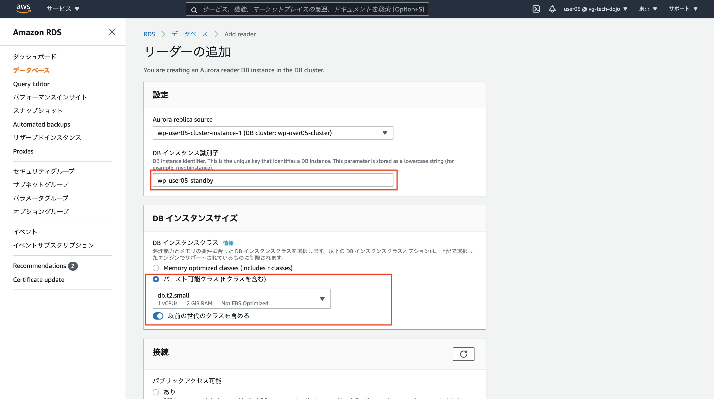
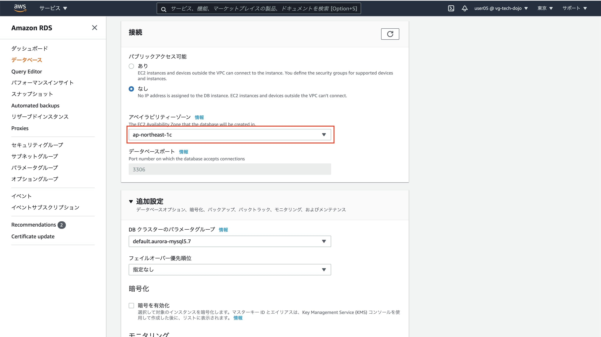
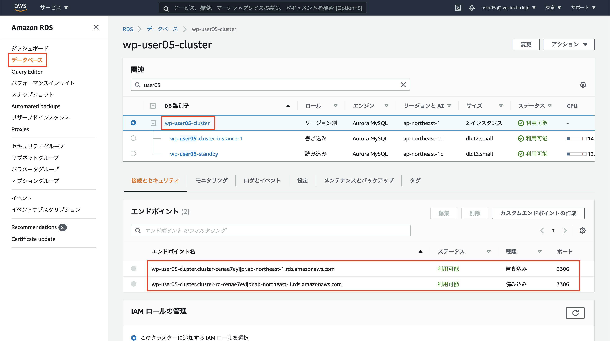
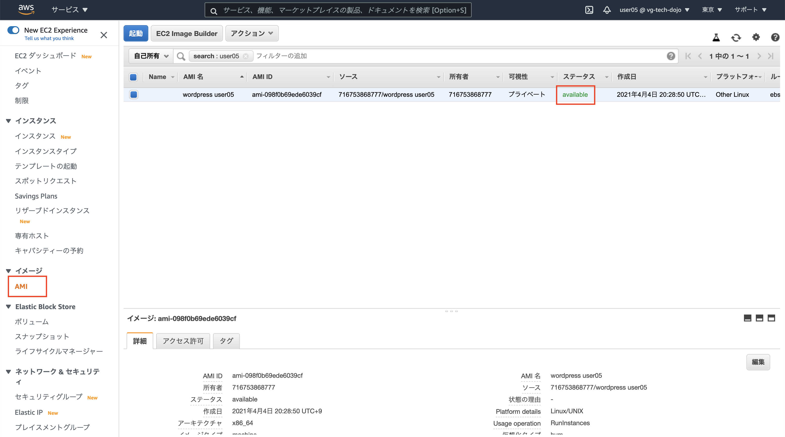
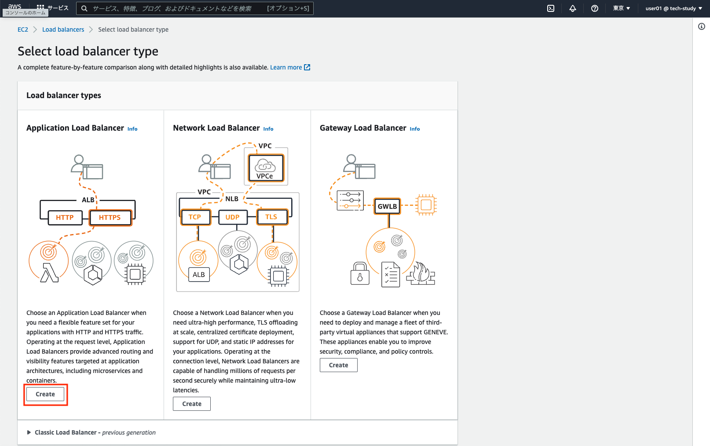
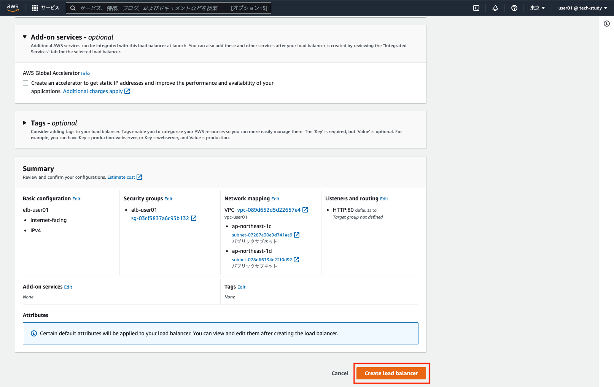
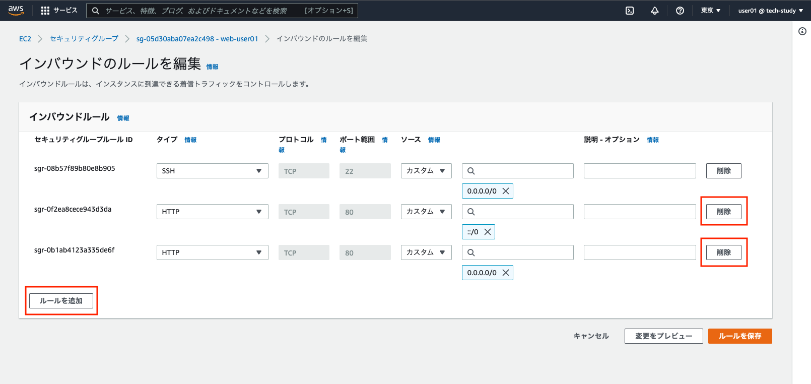
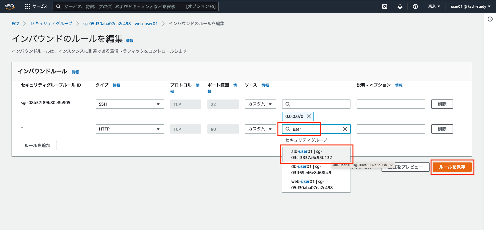

# Step-3

Step-3 では Web サーバとアプリケーションレイヤの水平分散、データベースレイヤの冗長化を行います。具体的には Step-2 の環境にロードバランサを配置し EC2 インスタンスを 2 つのアベイラビリティゾーンに水平分散、プライベートサブネットに配置されたデータベース Aurora を同様に 2 つのアベイラビリティゾーンに配置(MultiA-Z 構成)し冗長構成とします。

## 概要図


---

## Aurora を MultiA-Z 構成に変更

**ここでは Step-2 で作成した Aurora インスタンスを MultiA-Z の機能を用いて冗長化します。サービスから RDS を選択しましょう**


---

**左側のデータベースリンクをクリックしクラスターにチェック、アクションからリーダーの追加を押下**


---

**DB インスタンス識別子では「wp-ユーザ名-standby(例 wp-user05-standby)」としましょう**



---

**下にスクロールし接続でアベイラビリティゾーンは「ap-northeast-1c」を選択、インターネットゲートウェイからのアクセスは抑止するためパブリックアクセス可能では"いいえ”を選択。暗号化を無効にするを選択**



---

**下にスクロールし、「暗号を有効化」「拡張モニタリングの有効化」「マイナーバージョン自動アップグレードの有効化」のチェックは外れていること。「Add reader」を押下**


---

**約 5 分ほどで Aurora のレプリカは作成されます。画面中央上のリロードボタンを押して「利用可能」になるまで待ちましょう**


---

## Question 水平分散とは

水平分散について調べてみましょう(10 分)

---

## Aurora クラスターの確認

**データベースリンクから作成したクラスターリンクを押下しクラスターエンドポイント、読み取りエンドポイントが利用可能か確認しましょう。**

**クラスターエンドポイント(上)、読み込みエンドポイント(下)の確認をしましょう**



---

## 接続確認

**EC2 サーバに SSH 接続し、EC2 サーバから Aurora に接続してみましょう。また作成した Aurora インスタンスが意図したセグメントに配置されているかも確認しましょう。**

```
$ ssh -i 1day-userXX.pem -o StrictHostKeyChecking=no ec2-user@ec2-XXXXXX.com
[ec2-user@ip-10-0-0-65 ~]$
```

**クラスタエンドポイントを使用して Aurora に接続しましょう。**

**注意 wp-userXX-cluster.cluster-cenae7eyijpr.ap-northeast-1.rds.amazonaws.com は各自のクラスタエンドポイントに直すこと。パスワードは Aurora 作成時に設定した内容(この資料では wordpress となっています)を指定すること**

```
$ mysql -u admin -p -hwp-user05-cluster.cluster-cenae7eyijpr.ap-northeast-1.rds.amazonaws.com

mysql> show databases;
+--------------------+
| Database           |
+--------------------+
| information_schema |
| mysql              |
| performance_schema |
| wordpress          |
+--------------------+
4 rows in set (0.01 sec)

mysql> exit
```

**続いてクラスタエンドポイントが存在するネットワークセグメントの確認をしましょう。10.0.2.XXX なら正しい設定です**

```
$ nslookup wp-user05-cluster.cluster-cenae7eyijpr.ap-northeast-1.rds.amazonaws.com
Server:     10.0.0.2
Address:    10.0.0.2#53

Non-authoritative answer:
wp-user05-cluster.cluster-cenae7eyijpr.ap-northeast-1.rds.amazonaws.com canonical name = wp-user05.cenae7eyijpr.ap-northeast-1.rds.amazonaws.com.
Name:   wp-user05.cenae7eyijpr.ap-northeast-1.rds.amazonaws.com
Address: 10.0.2.226
```

**読み込みエンドポイントを使用して Aurora に接続しましょう。**

**注意 wp-userXX-cluster.cluster-ro-cenae7eyijpr.ap-northeast-1.rds.amazonaws.com は各自の読み込みエンドポイントに直すこと。パスワードは Aurora 作成時に設定した内容を指定すること**

```
$ mysql -u admin -p -hwp-userXX-cluster.cluster-ro-cenae7eyijpr.ap-northeast-1.rds.amazonaws.com

mysql> show databases;
+--------------------+
| Database           |
+--------------------+
| information_schema |
| mysql              |
| performance_schema |
| wordpress          |
+--------------------+
4 rows in set (0.02 sec)

mysql> select @read_only;
+------------+
| @read_only |
+------------+
| NULL       |
+------------+
1 row in set (0.01 sec)

mysql> create database hoge;
ERROR 1290 (HY000): The MySQL server is running with the --read-only option so it cannot execute this statement

mysql> exit
```

**続いて読み込みエンドポイントが存在するネットワークセグメントの確認をしましょう。10.0.3.XXX なら正しい設定です**

```
$ nslookup wp-user05-cluster.cluster-ro-cenae7eyijpr.ap-northeast-1.rds.amazonaws.com
Server:     10.0.0.2
Address:    10.0.0.2#53

Non-authoritative answer:
wp-user05-cluster.cluster-ro-cenae7eyijpr.ap-northeast-1.rds.amazonaws.com  canonical name = wp-user05-slave.cenae7eyijpr.ap-northeast-1.rds.amazonaws.com.
Name:   wp-user05-slave.cenae7eyijpr.ap-northeast-1.rds.amazonaws.com
Address: 10.0.3.217
```

## 系切り替え

**冗長構成となった Aurora のクラスターエンドポイントを切り替えてみましょう。左のデータベースリンクをクリックし、Step-2 で作成した Aurora インスタンスにチェック、アクションの操作プルダウンからフェイルオーバーを選択しましょう**


---

**フェイルオーバーボタンを押下**


---

**フェイルオーバー選択ごインスタンスが表示されている項目右端のレプリケーションロール「書き込み」「読み込み」が入れ代わればフェイルオーバー成功です。中央上のリロードを押し確認しましょう。数分掛かります**


---

**書き込み」「読み込み」が入れ代わればフェイルオーバー成功です**


---

## Question MultiA-Z とは

AWS MultiA-Z について調べてみましょう(10 分)

---

## 接続確認

**EC2 サーバに SSH 接続し、EC2 サーバから Aurora に接続してみましょう。フェイルオーバーにて作成した Aurora インスタンスが意図したセグメントに配置されているかも確認しましょう**

```
$ ssh -i 1day-userXX.pem -o StrictHostKeyChecking=no ec2-user@ec2-XXXXXX.com
[ec2-user@ip-10-0-0-65 ~]$
```

**クラスタエンドポイントが存在するネットワークセグメントの確認をしましょう。10.0.3.XXX なら正しい設定です**

```
$ nslookup wp-user05-cluster.cluster-cenae7eyijpr.ap-northeast-1.rds.amazonaws.com
Server:     10.0.0.2
Address:    10.0.0.2#53

Non-authoritative answer:
wp-user05-cluster.cluster-cenae7eyijpr.ap-northeast-1.rds.amazonaws.com canonical name = wp-user05-slave.cenae7eyijpr.ap-northeast-1.rds.amazonaws.com.
Name:   wp-user05-slave.cenae7eyijpr.ap-northeast-1.rds.amazonaws.com
Address: 10.0.3.217
```

**読み込みエンドポイントが存在するネットワークセグメントの確認をしましょう。10.0.2.XXX なら正しい設定です**

```
$ nslookup wp-user05-cluster.cluster-ro-cenae7eyijpr.ap-northeast-1.rds.amazonaws.com
Server:     10.0.0.2
Address:    10.0.0.2#53

Non-authoritative answer:
wp-user05-cluster.cluster-ro-cenae7eyijpr.ap-northeast-1.rds.amazonaws.com  canonical name = wp-user05.cenae7eyijpr.ap-northeast-1.rds.amazonaws.com.
Name:   wp-user05.cenae7eyijpr.ap-northeast-1.rds.amazonaws.com
Address: 10.0.2.226
```

## Web サーバの AMI を作成

**ここでは Web サーバの水平分散にて必要となる EC2 サーバの AMI を作成しましょう。AMI を作成することでここまで EC2 サーバに設定した内容など全て反映された状態(Aurora の接続情報等)で水平分散が可能になります。**

**サービスから EC2 を選択**


---

**左のインスタンスを選択し、Step-1 で作成した EC2 インスタンス「webserver#1-userXX」にチェック、アクションプルダウンからイメージとイメージの作成を選択しましょう**


---

**イメージ名、イメージの説明ともに「wordpress ユーザ名」で設定、設定後「イメージの作成」を押下**


---

**左下 AMI を選択し AMI が作成されステータスが「available」になれば完了です。数分で作成が完了します**



---

## 2 台目の EC2 インスタンスの作成(水平分散準備)

**インターネットゲートウェイ、ロードバランサーから HTTP リクエストを受け付ける Web+AP(WordPress)サーバである EC2 インスタンスを先ほど作成した AMI も用いて作成しましょう**

**左下 AMI リンクを選択、作成した AMI をチェック、アクションプルダウンから起動を選択**


---

**t2.micro が選択されていることを確認し、次の手順：インスタンスの詳細の設定ボタンを押下**


---

**以下を設定しましょう**

| 項目                      | 設定値                                               |
| :------------------------ | :--------------------------------------------------- |
| ネットワーク              | Step-1 で作った vpc を指定。vpc-userXX               |
| サブネット                | パブリックサブネット ap-northeast-1c 10.0.1.0 を指定 |
| 自動割り当てパブリック IP | 有効                                                 |


---

**特に設定せず、次の手順：タグの追加を押下**


---

**タグの追加ボタンを押下**


---

**キー「Name」、値「webserver#2-userXX」XX はユーザ ID を設定し、次の手順：セキュリティグループの設定を押下**


---

**Step-1 で作成したインターネットゲートウェイからリクエストを許可する Web サーバ用のセキュリティグループを割り当て、確認と作成ボタンを押下**


---

**作成ボタンを押下**


---

**Step-1 で作成したキーペアであることを確認し、「選択したプライベートキーファイル (1day-user05.pem) へのアクセス権があり、このファイルなしではインスタンスにログインできないことを認識しています。」にチェック後、インスタンス作成ボタンを押下**


---

**右下インスタンスの表示ボタンを押下**


---

**作成したインスタンスが表示され、作成完了であるステータスチェック「2/2 のチェックに合格しました」となるまで待ちましょう。作成完了まで数分掛かります**

**作成した#2 のインスタンスをチェックし、パブリック DNS(IPv4)のあたいをメモしブラウザで Wordpress が参照できるか確認しましょう**


---

**Wordpress が表示されれば成功です**


---

## EC2 サーバの確認

**作成した 2 台目の EC2 サーバにログイン(Wordpress を表示したパブリック DNS を使用)し IP アドレス、ゲートウェイ、ネームサーバなどを確認しましょう**

```
$ ssh -i 1day-userXX.pem -o StrictHostKeyChecking=no ec2-user@ec2-XXXXXXX.ap-northeast-1.compute.amazonaws.com

$ ip a
1: lo: <LOOPBACK,UP,LOWER_UP> mtu 65536 qdisc noqueue state UNKNOWN group default qlen 1
    link/loopback 00:00:00:00:00:00 brd 00:00:00:00:00:00
    inet 127.0.0.1/8 scope host lo
       valid_lft forever preferred_lft forever
    inet6 ::1/128 scope host
       valid_lft forever preferred_lft forever
2: eth0: <BROADCAST,MULTICAST,UP,LOWER_UP> mtu 9001 qdisc pfifo_fast state UP group default qlen 1000
    link/ether 0a:03:16:a3:6b:fa brd ff:ff:ff:ff:ff:ff
    inet 10.0.1.205/24 brd 10.0.1.255 scope global eth0
       valid_lft forever preferred_lft forever
    inet6 fe80::803:16ff:fea3:6bfa/64 scope link
       valid_lft forever preferred_lft forever

$ ip r
default via 10.0.1.1 dev eth0
10.0.1.0/24 dev eth0  proto kernel  scope link  src 10.0.1.205
169.254.169.254 dev eth0

$ cat /etc/resolv.conf
options timeout:2 attempts:5
; generated by /sbin/dhclient-script
search ap-northeast-1.compute.internal
nameserver 10.0.0.2
```

## ELB(ALB)の作成

**ここでは各 EC2 インスタンスにインターネットゲートウェイから直接アクセスするのではなく、ロードバランサー(ELB,ALB)経由でアクセスさせるために、作成した 2 台の EC2 インスタンスの前段にアクセスを振り分ける ELB(ALB)の作成を行います**

**左下ロードバランサーリンクをクリック、ロードバランサーの作成ボタンを押下**


---

**左の「Application Load Balancer」の作成ボタンを押下**



---

**名前は「elb-userXX」を設定し、下にスクロールしましょう**


---

**Step-1 で作成した VPC を選択するとアベイラビリティゾーンの選択ができます。ap-northeast-1c、ap-northeast-1d の両方にチェックし、表示されたパブリックサブネットを両方選択し、下にスクロールしましょう**


---

**「default」のセキュリティグループは「x」で削除、「create new security group」のリンクを押下**


---

**セキュリティグループは「alb-ユーザ名(例 alb-user01)」、説明も同じで、VPCはStep-1 で作成した VPC を選択、インバウンドルールでは「ルールを追加」を押下、「HTTP」を選択、ソース欄から「0.0.0.0/0」を選択し、下にスクロールしましょう**


---

**「セキュリティグループを作成」を押下**


---

**元の画面に戻り、セキュリティグループのリロードボタンを押下、「Security group」のプルダウンから先ほど作ったセキュリティグループ「alb-userXX」を選択、リロードでdefaultのセキュリティグループが登録されている場合は「x」で削除し、「Create target group」を押下**


---

**Target group nameは「tg-elb-ユーザ名(例 tg-elb-user01)」を記述し、下にスクロールしましょう**


---

**作成したVPCを選択し、「Next」を押下**


---

**全てのインスタンスをチェックし「Include as pending below」を押下、その後、下にターゲットが反映されたら「Create target group」を押下**


---

**元の画面に戻り「Listener」のリロードボタンを押下し作成したtarget group「tg-elb-userXX」を選択し、下にスクロールしましょう**


---

**「Create load balancer」を押下**



---

**「View load balancer」を押下**


---

**作成した ELB(ALB)をチェックし下部の説明タブの内容をスクロールさせ DNS 名をメモしましょう。最終的にはインターネットゲートウェイからのアクセスはこの DNS 名のみになります**


---

**先ほどメモした ELB(ALB)の DNS 名でブラウザを開きましょう。Wordpress が表示されれば成功です。ALB の設定から反映され、表示されるまで少し時間が掛かる可能性があります**


---

## Wordpress の設定変更

**EC2 サーバに接続しましょう(2 台のうちどちらでも可) 。EC2 から Aurora にクラスタエンドポイントで接続し option_value の更新を行いましょう。option_value 変更後管理画面にログインすると option_value で指定した ELB の DNS 名でアクセスしていれば成功です。設定後確認しましょう**

```
$ mysql -u admin -p -hwp-userXX-cluster.cluster-cenae7eyijpr.ap-northeast-1.rds.amazonaws.com
Enter password:

mysql> use wordpress
mysql> select option_value from wp_options where option_name = 'siteurl' or option_name = 'home';
+--------------------------------------------------------------+
| option_value                                                 |
+--------------------------------------------------------------+
| http://ec2-13-230-XX-73.ap-northeast-1.compute.amazonaws.com |
| http://ec2-13-230-XX-73.ap-northeast-1.compute.amazonaws.com |
+--------------------------------------------------------------+
2 rows in set (0.00 sec)

mysql> update wp_options set option_value='http://elb-userXX-1940738389.ap-northeast-1.elb.amazonaws.com' where option_name = 'siteurl' or option_name = 'home';
Query OK, 2 rows affected (0.00 sec)
Rows matched: 2  Changed: 2  Warnings: 0

mysql> select option_value from wp_options where option_name = 'siteurl' or option_name = 'home';
+---------------------------------------------------------------+
| option_value                                                  |
+---------------------------------------------------------------+
| http://elb-userXX-1940738389.ap-northeast-1.elb.amazonaws.com |
| http://elb-userXX-1940738389.ap-northeast-1.elb.amazonaws.com |
+---------------------------------------------------------------+
2 rows in set (0.00 sec)

mysql>
```

## セキュリティグループの変更

**現在 HTTP リクエストはインターネットゲートウェイを経由後 ELB、各 EC2 インスタンスの全てが受け付けています。この設定をインターネットゲートウェイから ELB を経由し各 EC2 インスタンスに振り分けられるようにし、合わせて EC2 インスタンスへ直接 HTTP アクセスは禁止するようセキュリティグループの変更をしましょう**

**確認：パブリック DNS を確認(メモ)しブラウザで WordPress を開きましょう**


---

**確認：パブリック DNS を確認(メモ)しブラウザで WordPress を開きましょう**


---

**確認：DNS 名を確認(メモ)しブラウザで WordPress を開きましょう**


---

**現時点では EC2 インスタンス 2 台のパブリック DNS、ELB(ALB)の DNS 名の全てで WordPress が表示(HTTP リクエストが通る)できるはずです。これを ELB(ALB)の DNS 名のみアクセス許可にします**


---

**左下のセキュリティグループから作成した EC2 インスタンス用のセキュリティグループ「web-userXX」をチェックし、インバウンドタブで表示されるルールを確認しましょう。この中にある HTTP のルールを変更します。編集ボタンを押下**


---

**インバウンドの一HTTP のルールはバツボタンにて削除し「ルールを追加」を押下**



---

**「user」などで補完し作成した「alb-userXX」を選択し「ルールを保存」を押下**



---

**ELB(ALB)経由でアクセス出来れば設定成功です**


---

**2 台の EC2 に直接アクセスした場合はタイムアウトなどでエラーとなれば設定成功です**


---

## アクセス確認

**作成した 2 台の EC2 環境に ELB(ALB)からアクセスが振り分けられているかアクセスログから確認してみましょう**

```
$ sudo tail -f /var/log/nginx/access.log
```

## 振り返り

今回の作業、作成した環境で不足してると思われるもの、アプリケーションなどで見られる細かい不具合などを各自調べてみましょう。その後振り返りをしましょう(10 分)

ここまでで全ての Step が完了です！お疲れ様でした！
